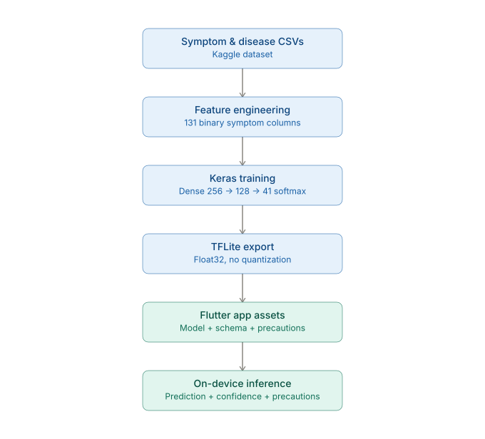
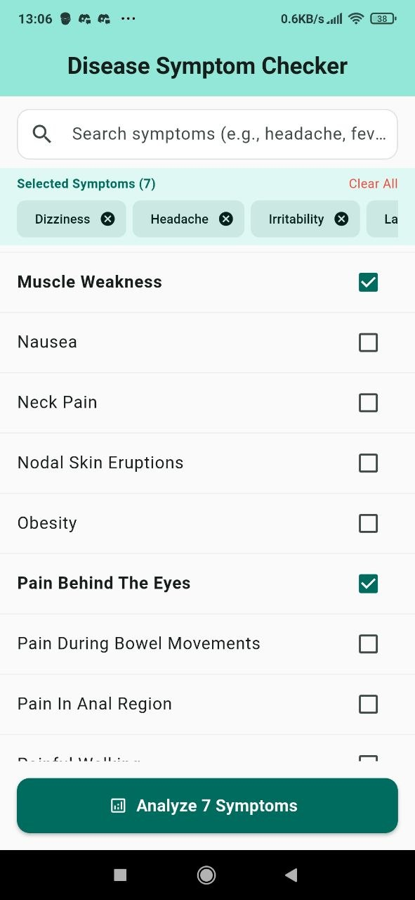
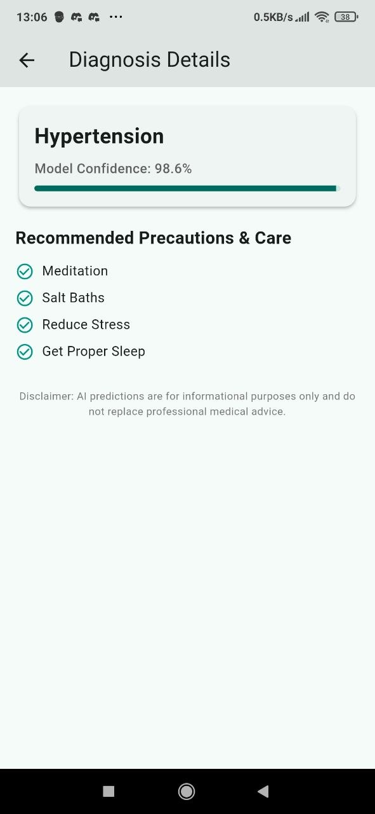

# AI Symptom Checker — On-Device TFLite Inference in Flutter

An end-to-end pipeline: trains a neural network on symptom/disease data, converts it to TFLite, and runs it fully on-device in a Flutter mobile app — no server, no API calls, inference happens on the phone.

## What this demonstrates

Most "disease predictor" projects stop at a notebook with a printed accuracy score. This one goes further: **the full path from a trained model to a working mobile app**, including the real debugging that comes with it (model format incompatibility, TFLite op-version mismatches, asset loading).

## Architecture



Blue stages run in Python/Kaggle during training; teal stages are the on-device Flutter app. The `.tflite` model, `symptom_schema.json`, and `disease_precautions.json` are the three artifacts that cross from one side to the other.

## App screenshots

<table>
  <tr>
    <td></td>
    <td></td>
  </tr>
  <tr>
    <td align="center"><sub>Selecting symptoms</sub></td>
    <td align="center"><sub>Prediction + precautions</sub></td>
  </tr>
</table>

## Project structure

- **`model_training/`** — Python/Keras training pipeline that builds a classifier over ~130 symptoms mapped to ~40 diseases, and exports it as a `.tflite` file for mobile deployment.
- **`flutter_app/`** — Flutter app that loads the `.tflite` model directly on-device, lets the user select symptoms via a searchable checklist, runs inference locally, and shows the predicted condition with confidence score and precautions.

## Why Keras, not scikit-learn

The first version of this pipeline trained an sklearn `VotingClassifier` (RandomForest + ExtraTrees + XGBoost). That produced strong offline accuracy but **cannot be converted to TFLite** — sklearn/XGBoost models have no supported path to the TFLite format. Switching to a Keras `Sequential` model was necessary specifically to make on-device deployment possible; this is documented in the training script and is a real constraint worth knowing before choosing a modeling library for a mobile-deployment project.

## A real bug worth documenting

Early TFLite exports used `converter.optimizations = [tf.lite.Optimize.DEFAULT]` (post-training quantization). This bumped the `FULLY_CONNECTED` op to a version newer than the `tflite_flutter` plugin's bundled runtime supported, causing:

```
E/tflite: Didn't find op for builtin opcode 'FULLY_CONNECTED' version '12'.
E/tflite: Registration failed.
```

Fix: export without quantization (plain float32). Trade-off is a larger model file, acceptable at this model's small size (~280 KB).

## Results

- Trained on a symptom/disease dataset with 131 binary symptom features → 41 disease classes
- Model exported at ~280 KB, well within mobile app size budgets
- Runs fully offline on-device via `tflite_flutter`

## Setup

### Model training (Kaggle or local)

```bash
cd model_training
pip install -r requirements.txt
python train_and_export_tflite.py
```

Outputs `disease_model.tflite`, `symptom_schema.json`, and `disease_precautions.json` — copy these three files into `flutter_app/assets/`.

### Flutter app

```bash
cd flutter_app
flutter pub get
flutter run
```

Requires the three files above to already be present in `flutter_app/assets/` (already included in this repo — retrain only if you want to reproduce or modify the model).

## Known limitations

- The underlying dataset maps symptoms to diseases deterministically with little real-world noise — high accuracy here reflects the dataset's structure more than real diagnostic difficulty. Real symptom reporting is messier and more ambiguous than this data captures.
- This app is a portfolio/technical demonstration of on-device ML deployment, not a medical tool. It includes an in-app disclaimer and should never be treated as diagnostic.
- Precaution text is dataset-sourced and generic; it is not personalized or clinically reviewed.

## License

Dataset: check the original Kaggle dataset's license before redistribution. Code in this repo: MIT (or your preferred license — update this line).
